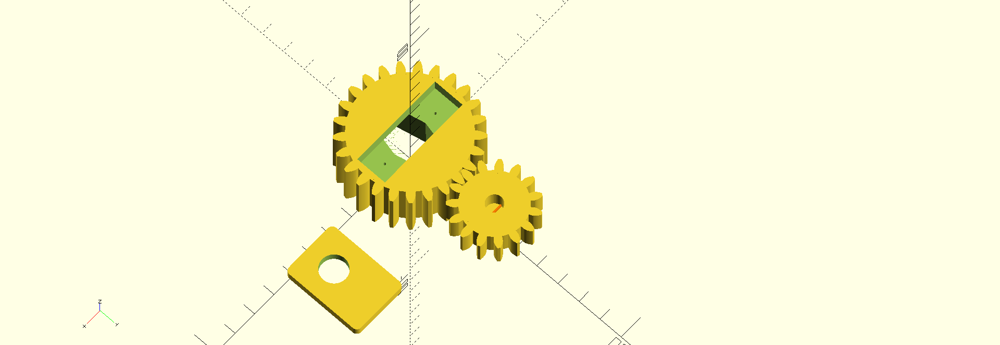

# Lockbot

Lockbot is a robot attached to our door that makes it possible for trusted members who don't have a key to open the door. It consists of a servo motor, two gears, a potentiometer and an Arduino Uno.

## Build instructions

1. Install the Arduino IDE
2. Install the needed libraries in the Library Manager (see the top of `lockbot.ino`)
3. Copy `tokens.h.example` to `tokens.h` and edit them if nescessary
4. Select 'Arduino Uno' from the Board options
5. Program the Arduino

## 3D-print instructions

1. Install OpenSCAD
2. To print each part, comment out the other parts, export as STL then 3D print it. The big gear should be printed with 5 perimeter walls and solid infill, so it can handle the forces.

