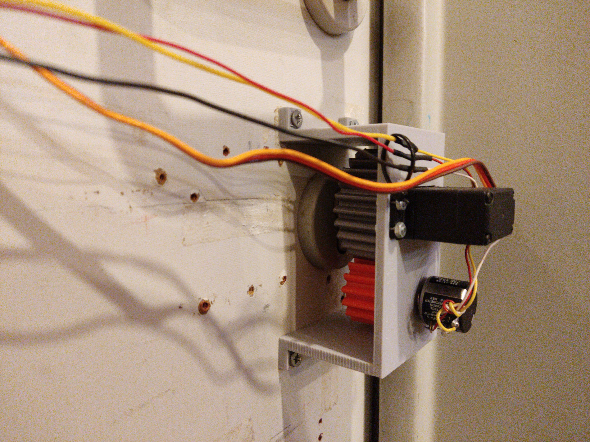
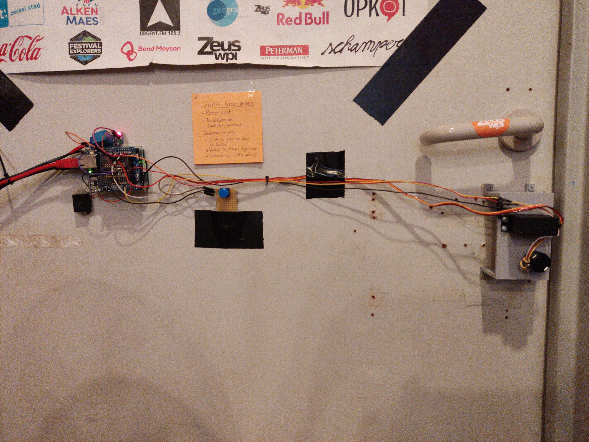
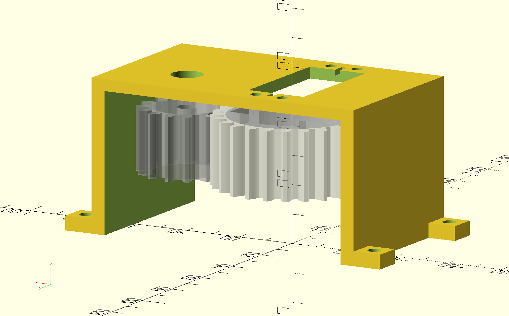

# Lockbot

Lockbot is a robot attached to our door that makes it possible for trusted members who don't have a key to open the door. It consists of a servo motor, two gears, a potentiometer and an Arduino Uno + ethernet shield.






## Microcontroller build instructions

Requires the `platformio` cli tool, follow [these instructions](https://docs.platformio.org/en/latest/core/installation/methods/installer-script.html) to install it.

Next, in [arduino/src](arduino/src), copy `tokens.h.example` to `tokens.h` and edit them if nescessary.

Finally, in [arduino](arduino), build and flash using the following:
```sh
. ~/.platformio/penv/bin/activate # Might depend on platform
pio run -t clean
pio run
pio run -t upload -t monitor
```

## 3D-print instructions

1. Install OpenSCAD
2. To print each lockbot part, open `printfile.scad` in OpenSCAD, uncomment the part you want to print, render it, export as STL then 3D print it. The big gear should be printed with 5 perimeter walls and solid infill, so it can handle the forces.



The NFC plate that holds the NFC cards is also included in this repository, see `nfc_plate.scad`. There's spacers for the motor in `spacer.scad`, this will need to be modified for different motors.

## Components

- Arduino Uno + power supply for Arduino Uno (5V USB)
- Servo motor: TD-8130MG 360° Servo Motor - 30kg/cm + separate power supply for the servo motor
- Relay (also connected to motor power supply)
- Ethernet shield
- Buzzer
- Button
- 10k multiturn potentiometer

See [lockbot.cpp](arduino/src/lockbot.cpp) for how to connect these components together.

Make sure that when turning the lock, the multiturn potentiometer does not go out of bounds
(overturning it WILL break it).

## Calibration

Before lockbot can be used, you'll need to calibrate 4 points using `client.py <subcommand>`

- `calibrate_open_pos`: the position you'd like lockbot to go to when opening the door
- `calibrate_open_bnd`: the last position where you consider the door as 'open'
- `calibrate_close_bnd`: the first position where you consider the door as 'locked'
- `calibrate_close_pos`: the position you'd like lockbot to go to when closing the door
